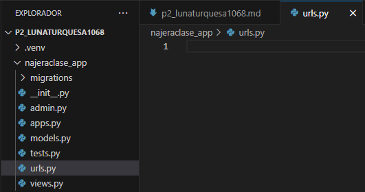
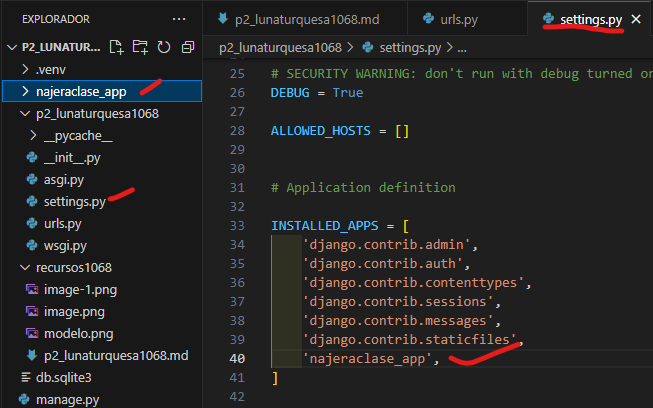
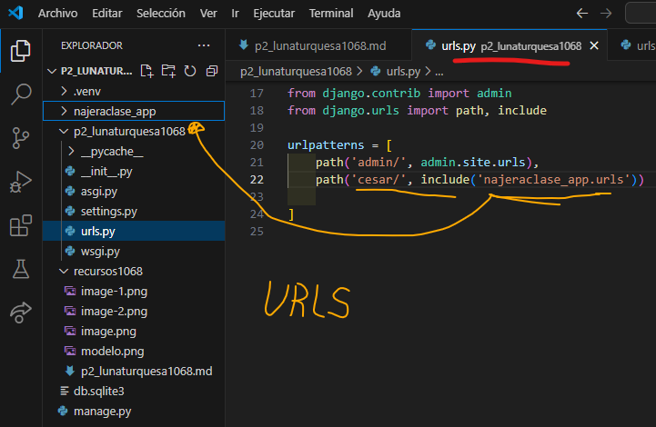
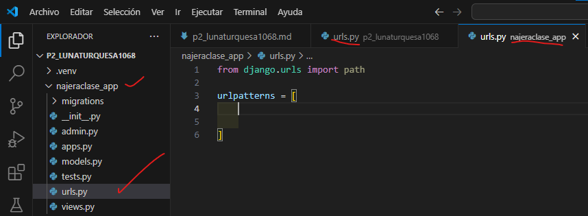
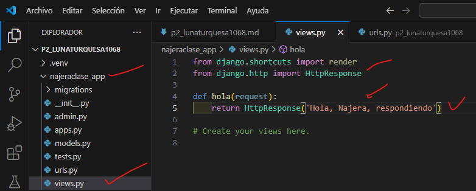
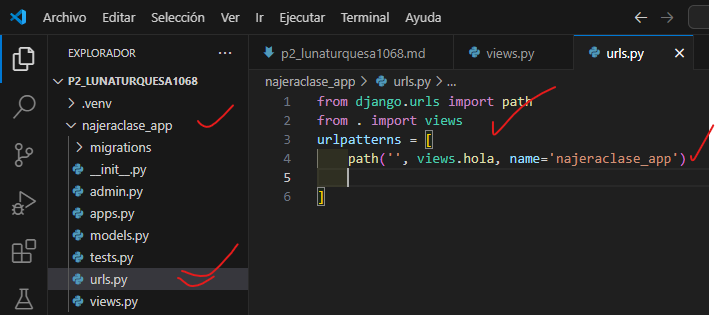

- Crear aplicacion najeraclase_app
- Comando --> python manage.py startapp najeraclase_app
- Creamos el archvio urls.py en najeraclase_app
- 
- En setting.py crear najeraclase_app en lunaturquesa1068
- 
- En urls.py de p2_lunaturquesa1068 
- 
-  En urls.py de najeraclase_app
- 
- En views.py en najeraclase_app
- 
- En urls.py en najeraclase_app
- 